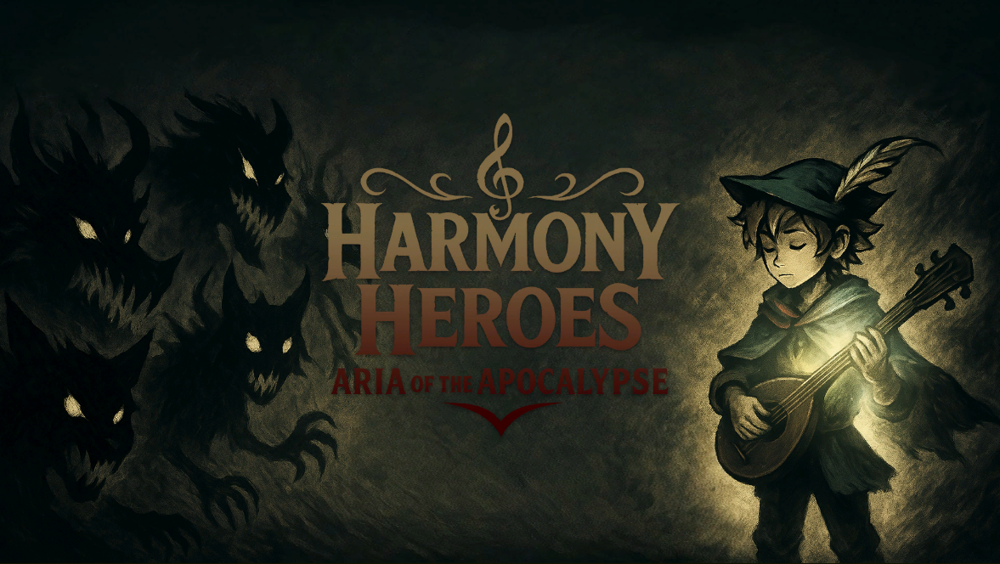
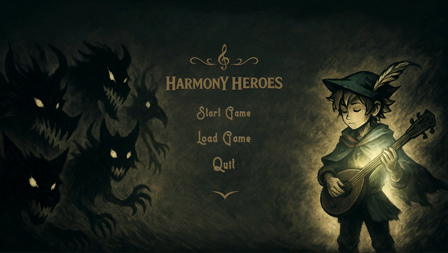
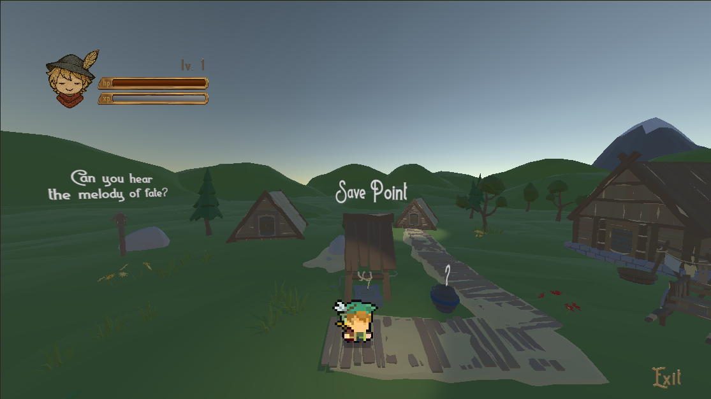
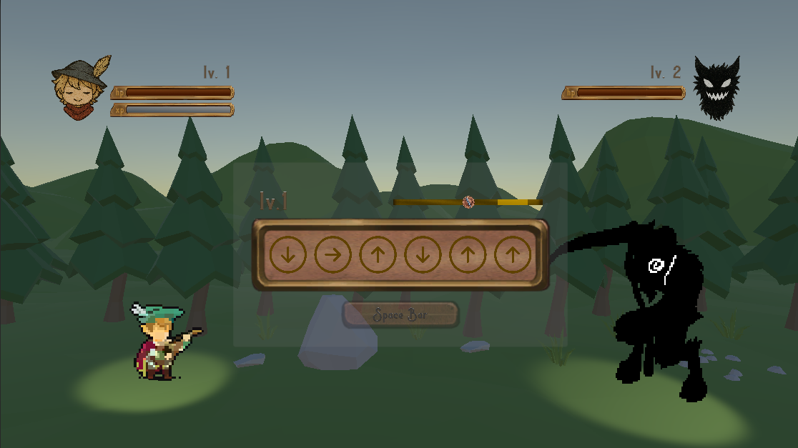
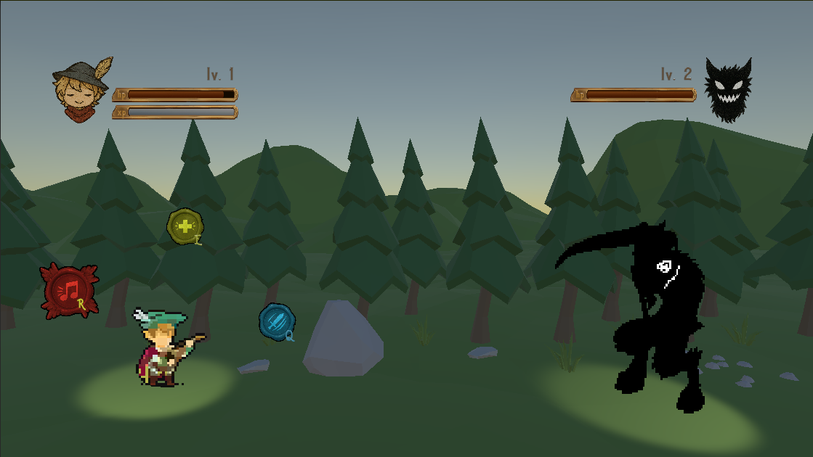
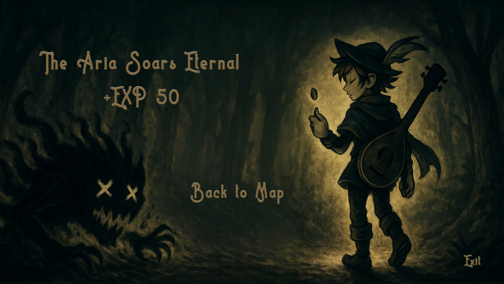
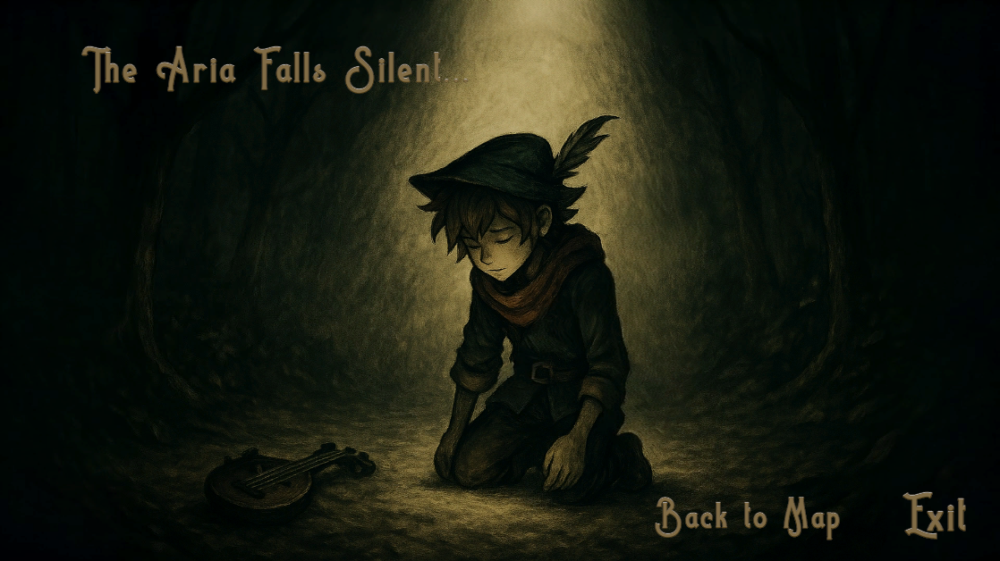
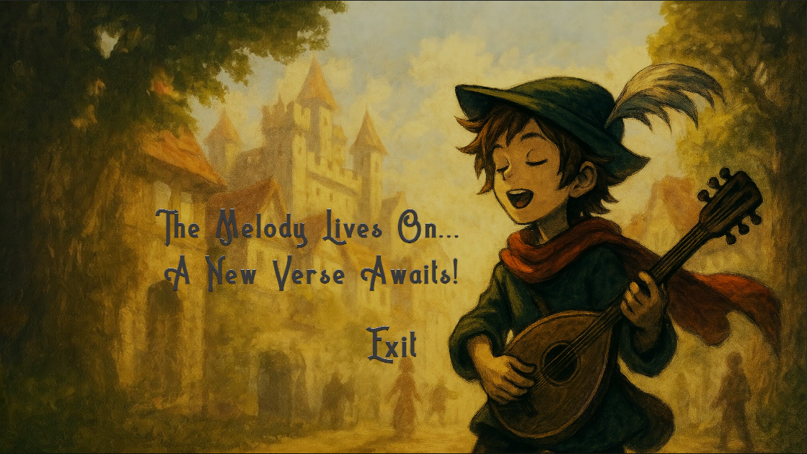

# HarmonyHeros
 

## Introduction
It is a single-player turn-based rhythm game. The game will follow a young bard who’s on his quest to save his partner. Players will be able to battle infected monsters found in the overworld and fend for themselves by purifying them.

## Game Scene
### Game Start

### Menu

### Level 

### Battle: Rhythm 

### Battle: Action 

### Battle Win

### Battle Lose

### Game Over

## Build & Source Code
- Demonstration Video: https://youtu.be/efdeuWxwAgQ
- WebGL Version Available (PC): https://yobisaboy.itch.io/harmony-heroes
- Game Download: https://github.com/yobisaboy/HarmonyHeros
- Unity Project: https://github.com/CR3XX12/COMP390_001_HarmonyHero

## Contact
- Tel: +1 (647) 637-0831
- Email: hoyiuyiuyoyo@gmail.com
- LinkedIn: https://www.linkedin.com/in/yoyoho
- Portfolio: https://yobisaboy.github.io/Portfolio
